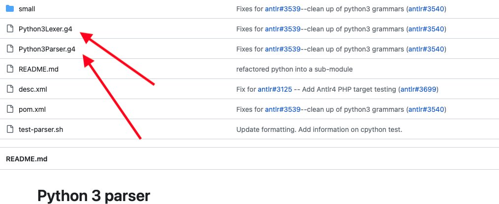
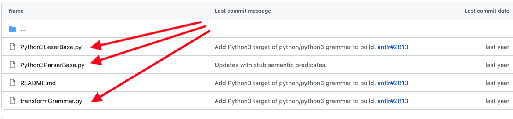

# How to generate Python Plugin Lexer/Parser/Visitor

------


## Introduction

We use the antrl4 toolbox

```
pip install antlr4-tools
```

We use this [grammar](https://github.com/kaby76/grammars-v4/tree/master/python/python3/Python3)



This URL is for Python 3.13.2

https://github.com/RobEin/ANTLR4-parser-for-Python-3.13


## Set up the virtual environment


```bash
python -m venv pyenv-antlr-4.13.1
source pyenv-antlr-4.13.1/bin/activate
pip install antlr4-tools
```


Get the complete jar from https://www.antlr.org/download.html

Get the lexer/parser .g4 files from here:  https://github.com/kaby76/grammars-v4/tree/master/python/python3



## Generate Python 3.11.5 parser


### Updates .g4 files for python

```bash
python transformGrammar.py
```


### Finally

```bash
antlr4 -Dlanguage=Python3 -visitor -no-listener -package pyutplugins.ioplugins.python -o pythonparser *.g4
```

Copy the files in the `pythonparser` directory back to the git sandbox